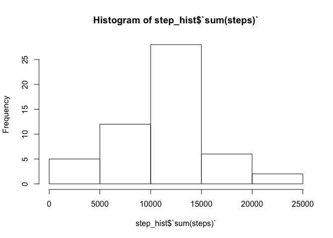
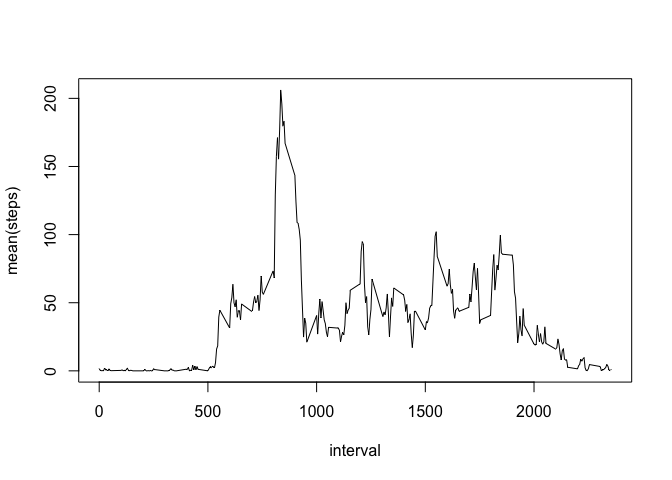
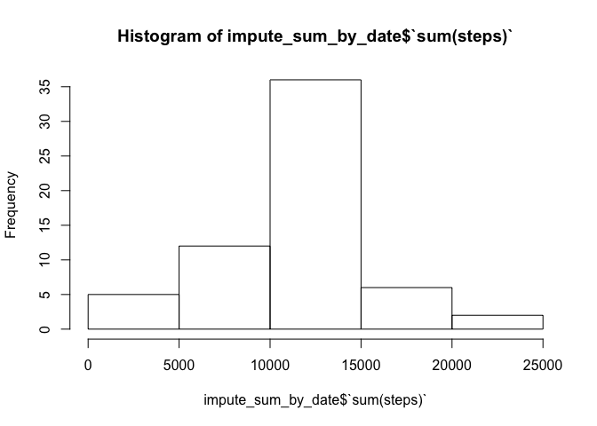
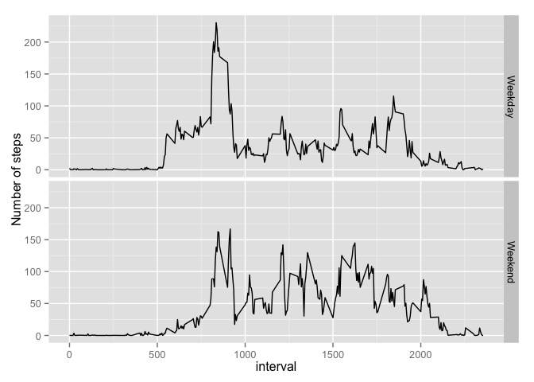

# Reproducible Research: Peer Assessment 1


## Loading and preprocessing the data

```r
  library(dplyr)
```

```
## 
## Attaching package: 'dplyr'
## 
## The following objects are masked from 'package:stats':
## 
##     filter, lag
## 
## The following objects are masked from 'package:base':
## 
##     intersect, setdiff, setequal, union
```

```r
  activity <- read.csv("/Users/sshen/Courses/reproducible/RepData_PeerAssessment1/activity.csv", as.is=T)
  complete <- activity[!is.na(activity$steps),]
```

## What is mean total number of steps taken per day?

```r
  step_hist <- summarise(group_by(complete, date), sum(steps))
  hist(step_hist$`sum(steps)`)
```

 

```r
  mean(step_hist$`sum(steps)`)
```

```
## [1] 10766.19
```

```r
  median(step_hist$`sum(steps)`)
```

```
## [1] 10765
```


## What is the average daily activity pattern?

```r
  series <- summarise(group_by(complete, interval), mean(steps))
  plot(series, type="l")
```

 

```r
  series$interval[series$`mean(steps)` == max(series$`mean(steps)`)]
```

```
## [1] 835
```

## Imputing missing values

```r
  count_missing <- sum(is.na(activity$steps))
  count_missing
```

```
## [1] 2304
```

```r
  imputed = activity
  for (i in 1:length(series$interval))
  {
    index <- imputed$interval==series$interval[i]
    imputed$steps[is.na(activity$steps) & index] <- series$`mean(steps)`[i]
  } 
  impute_sum_by_date <- summarise(group_by(imputed, date), sum(steps))
  hist(impute_sum_by_date$`sum(steps)`)
```

 

```r
  mean(impute_sum_by_date$`sum(steps)`)
```

```
## [1] 10766.19
```

```r
  median(impute_sum_by_date$`sum(steps)`)
```

```
## [1] 10766.19
```
Estimate of mean remains the same because the missing values were imputed using
mean value. Estimate of median shifted to be the same as the mean because again
the missing values were filled in with mean value.

## Are there differences in activity patterns between weekdays and weekends?

```r
  library(ggplot2)
  imputed$date2 <- weekdays(as.Date(imputed$date))
  imputed$date2[(imputed$date2 %in% c("Saturday", "Sunday"))] <- "Weekend"
  imputed$date2[!(imputed$date2=="Weekend")] <- "Weekday"
  imputed$date <- as.factor(imputed$date2)
  series_impute <- summarise(group_by(imputed, interval, date), mean(steps))
  g <- ggplot(series_impute, aes(interval, `mean(steps)`))
  g + geom_line() + facet_grid(date ~ . ) + labs(y = "Number of steps")
```

 
